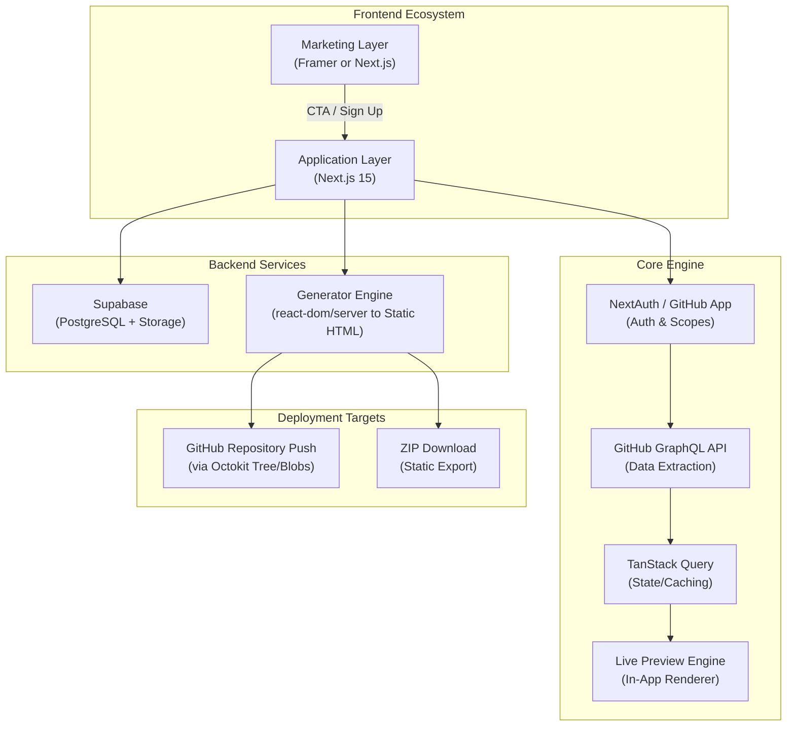

# GitFolio Engine Project Plan

**Automating Developer Presence via GitHub-to-Portfolio Synchronization.**

## 📌 Executive Summary
**GitFolio Engine** is a SaaS-style web application designed to allow developers to generate a professional, zero-maintenance hosted portfolio website in under 60 seconds. By seamlessly authenticating via GitHub Apps, the system extracts rich repository data, contribution history, and technology stacks to dynamically build a highly customizable dashboard using pre-defined templates. This portfolio can then be exported as a static site or pushed directly to a new repository on the user's GitHub account and deployed effortlessly via GitHub Pages.

---

## 🏗️ System Architecture

### 1. The Frontend Ecosystem
*   **Marketing Layer:** Handles high-fidelity animations, responsive landing page copy, and optimized user acquisition funnels.
*   **Application Layer (Next.js 15):** Serves as a secure, authenticated dashboard utilizing Tailwind CSS and Shadcn UI components for a modern, sleek interface.

### 2. The Core Engine (Next.js + Node.js)
*   **Data Extraction:** Utilizes the robust **GitHub GraphQL API** to fetch deeply nested data (e.g., repository stars, primary languages, commit history, and README contents) in a highly efficient single round-trip.
*   **State Management & Caching:** Implements **TanStack Query** to manage asynchronous state, ensuring real-time UI updates seamlessly as users toggle projects, and heavily caching expensive GitHub GraphQL requests.
*   **Template & Generation Approach:** Employs **pre-defined component-based templates** (e.g., `Minimalist.tsx`) built as clean TSX components. The server converts these into final, lightweight static strings using `react-dom/server`'s `renderToStaticMarkup`.
*   **Persistence:** Relies on **Supabase (PostgreSQL)** to securely store user-specific configurations, theme selections (`themes`), session mappings, and `deployments` (tracking the `github_push` or `zip` types).

---

## 🔄 Detailed Application Workflow

### Step 1: Secure Authentication
*   **Process:** Users seamlessly sign in via **Auth.js**.
*   **GitHub App:** Highly recommended to use a **GitHub App** rather than a pure OAuth App. This allows finer-grained permissions and stronger user trust.
*   **Permissions:** By default, the app only requests the non-invasive `read:user` scope. Permission escalation to request write access (to push repos) is deferred until the user explicitly attempts to auto-deploy.
*   **Security Measures:** The resulting GitHub access token is rigorously encrypted via AES-256 before persisting securely.

### Step 2: Intelligent Data Aggregation & Caching
The engine intelligently queries and collates data using the GitHub GraphQL API:
*   **Data Caching (Phase 2):** To circumvent rate limits, GraphQL replies are heavily cached locally using TanStack Query.
*   **Filtering Mechanisms:** Automatically ignores forks and purposefully filters out repositories with fewer than 2 commits.
*   **Data Analysis:** Dynamically calculates a "Skill Cloud" weighting by comprehensively analyzing the byte-size of programming languages used across public repositories.

### Step 3: The Customization & Live Preview Dashboard
Users engage with an interactive dashboard to personalize their portfolios:
*   **Pre-defined Templates:** We offer curated, high-quality component-driven templates starting with the **Minimalist** template first. The live preview in the app matches the final static output 100%.
*   **Live Preview Engine:** A mock frame renders a true 1:1 Live Preview entirely within the Next.js app, powered directly by injecting data into the same React component templates used for generation.
*   **Project Curation:** Selectively pin and arrange top-tier projects.
*   **Metadata Editing:** Inject a custom bio and smoothly link external references.

### Step 4: Push to GitHub Repo + Enable GitHub Pages
When the user is fully satisfied with the Live Preview, they click **"Generate & Push to GitHub"**:
1.  **Permission Escalation:** The app naturally requests repo creation/push scopes if not already granted via the GitHub App.
2.  **Generate Static Files:** The backend dynamically takes the chosen template and translates it to a fully valid `index.html` static site structure (with CSS and assets) entirely in-memory.
3.  **Octokit Integration:** Next.js uses the Octokit API to create a new repository (e.g., `username.github.io/portfolio` or `portfolio`) on the user’s account.
4.  **Bulk File Commit:** Utilizing Git tree/blobs methodology, it commits and pushes all generated files efficiently in a single operation to the `main` or `gh-pages` branch.
5.  **Post-Push Instruction Screen:** The app presents a clear success screen containing:
    *   Direct link to the newly created repository.
    *   **Clear, one-click instructions:** *"Go to your repo → Settings → Pages → Source: Deploy from a branch → Select 'main' (or gh-pages) → Save."*
    *   The expected final live URL (e.g., `https://username.github.io/portfolio`).
6.  **Trust-Building Alternative:** The "Download ZIP" option remains available for privacy-conscious developers.

---

## 🛠️ Technical Stack Summary

| Category | Technology |
| :--- | :--- |
| **Framework** | Next.js 15 (App Router), TypeScript |
| **Styling & UI** | Tailwind CSS, Shadcn UI, Framer Motion |
| **Database** | Supabase (PostgreSQL) |
| **Authentication** | Auth.js (Integrated NextAuth via GitHub Apps) |
| **Data APIs** | GitHub GraphQL API |
| **Deployment Automation** | Octokit (GitHub Rest API) for Git Blobs/Trees |
| **Generation Engine** | `react-dom/server` |
| **Security Validation** | Zod (Schemas), DOMPurify (XSS Prevention) |

---

## 🛡️ Cybersecurity & Performance Posture

*   **XSS Protection:** Considering the application ingests arbitrary content from GitHub READMEs, all parsed markup is rigorously sanitized employing DOMPurify *on the server* before generating the final static markup.
*   **Rate Limit Management:** By utilizing the GraphQL API alongside TanStack Query caching, the application limits API calls, effectively circumventing `403` errors.
*   **Secret Management:** Sensitive credentials—like the GitHub App Private Keys and OAuth Secrets—are handled strictly server-side.

---

## 📋 Prerequisites & Next Steps

Before implementation begins, we need the following resolved:
1.  **Create GitHub App:** Please create a GitHub App (not just an OAuth application). It provides the exact scopes we need to read profile data securely and optionally write to create their repository. Share the ID & Secret.
2.  **Database Instance:** Should we immediately initialize a new Supabase project in the `imrobot` organization to hold our configurations and deploy logs?
3.  **Template Focus:** As agreed, the **Minimalist** component-based template will be the first and primary template built to validate the end-to-end `react-dom/server` generation to static push approach.

---

## 📈 Future Roadmap

*   **"Re-generate & Update" Feature:** Allow users to synchronize changes to an already-created portfolio repository with a single click push.
*   **AI Repository Summarization:** Auto-generate concise summaries of individual repositories using LLMs.
*   **Developer Analytics Dashboard:** An expanded metrics view providing users robust insights.
