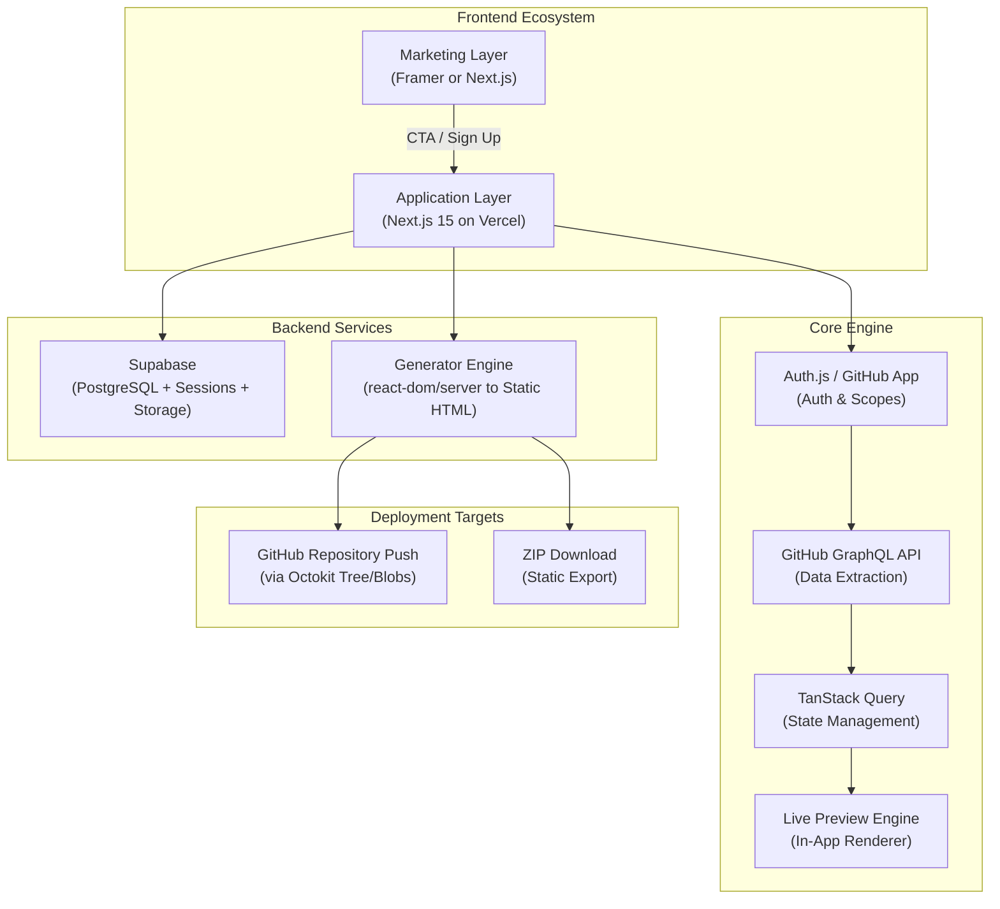
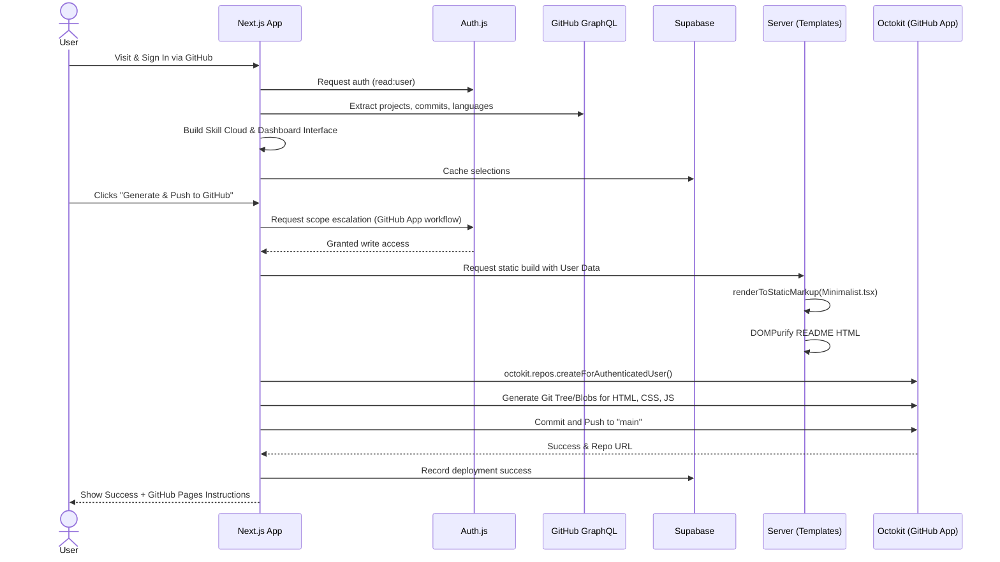

# GitFolio Engine — Complete Implementation Plan

> **Automating Developer Presence via GitHub-to-Portfolio Synchronization.**

---

## 📌 Executive Summary

**GitFolio Engine** is a SaaS-style web application that allows developers to generate a professional, zero-maintenance portfolio website in under 60 seconds. By authenticating with GitHub, the system extracts repository data, contribution history, and technology stacks to dynamically build a customizable portfolio dashboard. The portfolio is built using pre-defined templates injected with dynamic data and can be exported as a static ZIP or pushed directly to a new repository on the user's GitHub account for easy deployment via GitHub Pages.

---

## 🏗️ System Architecture



### 1. The Frontend Ecosystem

| Layer | Tech | Domain | Purpose |
|:---|:---|:---|:---|
| **Marketing** | Framer / Next.js | `gitfolio.dev` | Landing page, SEO, user acquisition funnels |
| **Application** | Next.js 15 (App Router) | `app.gitfolio.dev` | Authenticated dashboard, live preview, portfolio builder |

### 2. The Core Engine & Generation

| Component | Technology | Role |
|:---|:---|:---|
| **Data Extraction** | GitHub GraphQL API | Fetch repos, stars, languages, commits, READMEs efficiently |
| **State Management** | TanStack Query v5 | Async state, caching, optimistic rendering |
| **Generation Engine** | `react-dom/server` (`renderToStaticMarkup`) | Server-side conversion of dynamic TSX templates into lightweight static HTML |
| **Code Push Integration** | `octokit` | Efficient repo creation and multi-file commits using Git tree/blobs approach |
| **Persistence** | Supabase (PostgreSQL) | User configs, themes, sessions, social links |
| **Authentication** | Auth.js v5 (NextAuth) | GitHub App/OAuth with progressive scope escalation |

---

## 📁 Project Structure

```
gitfolio/
├── .env.local                          # Local environment variables
├── next.config.ts                      # Next.js configuration
├── tailwind.config.ts                  # Tailwind CSS configuration
├── package.json
│
├── public/
│   └── templates/                      # Static template assets (global CSS, images)
│
├── src/
│   ├── app/                            # Next.js App Router
│   │   ├── layout.tsx                  # Root layout
│   │   ├── globals.css                 # Global app styles
│   │   │
│   │   ├── (marketing)/               # Route group (if marketing is inside Next.js)
│   │   │
│   │   ├── (auth)/                     # Core auth flows
│   │   │
│   │   ├── dashboard/                  # Protected Builder Interface
│   │   │   ├── projects/
│   │   │   ├── preview/
│   │   │   ├── settings/
│   │   │   └── deploy/                # Deploy UI: Push to GH or D/L Zip
│   │   │
│   │   └── api/                        # API Routes
│   │       ├── portfolio/
│   │       │   ├── generate/route.ts  # Generates static HTML markup
│   │       │   ├── push/route.ts      # Octokit logic to create repo & push
│   │       │   └── download/route.ts  # JSZip generation
│   │       └── user/
│   │           └── config/route.ts
│   │
│   ├── components/
│   │   ├── ui/                         # Shadcn UI
│   │   ├── dashboard/                  # Dashboard complex components
│   │   └── preview/
│   │       └── preview-frame.tsx      # Embeds the generated visual preview
│   │
│   ├── lib/
│   │   ├── supabase/
│   │   ├── github/
│   │   │   ├── graphql.ts            # Read logic
│   │   │   └── octokit.ts            # Write logic (repo creation, blobs, commits)
│   │   ├── templates/                  # Pre-defined Templates!
│   │   │   ├── Minimalist.tsx        # TSX Component for static rendering
│   │   │   ├── Cyberpunk.tsx         # TSX Component for static rendering
│   │   │   ├── ClassicResume.tsx     # TSX Component for static rendering
│   │   │   └── template-renderer.ts  # Wrapper for renderToStaticMarkup
│   │   └── utils/
│   │       └── sanitize.ts           # DOMPurify implementation
│   │
│   ├── types/
│   └── schemas/
│
└── supabase/
    └── migrations/
```

---

## 🗃️ Database Schema Changes

Changes to support the new deployment method:

```sql
-- 006: Deployments
CREATE TABLE public.deployments (
    id UUID PRIMARY KEY DEFAULT gen_random_uuid(),
    portfolio_id UUID REFERENCES public.portfolios(id) ON DELETE CASCADE NOT NULL,
    repository_url TEXT, -- e.g., https://github.com/username/portfolio
    deployment_type TEXT CHECK (deployment_type IN ('github_push', 'zip')) NOT NULL,
    status TEXT CHECK (status IN ('pending', 'pushed', 'failed')) DEFAULT 'pending',
    deployment_metadata JSONB DEFAULT '{}',
    deployed_at TIMESTAMPTZ,
    created_at TIMESTAMPTZ DEFAULT NOW()
);
```

---

## 🔄 Detailed Application Workflow



### Step 1: Secure Authentication
- **OAuth Provider**: Auth.js, ideally integrated via a **GitHub App** (provides finer permissions and better user trust than OAuth Apps).
- **Initial Scope**: `read:user`.
- **Scope Escalation**: App triggers authorization to write repositories *only* when the user clicks "Push to GitHub".

### Step 2: Intelligent Data Aggregation
- Uses GitHub GraphQL API to compile repositories (excluding forks/<2 commits), and calculates the byte-weighted Skill Cloud.

### Step 3: Template-Based Generation & Preview
- **Pre-defined Templates**: Built as clean React TSX components (`Minimalist.tsx`, `Cyberpunk.tsx`, `ClassicResume.tsx`).
- **Live Preview**: The dashboard renders these components.
- **Why?** It ensures 100% consistency between the preview and the final exported code, improves speed, and prevents the fragility of building unique per-user configurations.

### Step 4: Frictionless Export & Git Push (Deployment)
When the user clicks "Generate & Push":
1. **HTML Generation**: Next.js server uses `react-dom/server` (`renderToStaticMarkup`) to transform the TSX template into a pure, lightweight `index.html` string.
2. **Push via Octokit**: 
   - Uses `octokit.repos.createForAuthenticatedUser` to create `username/portfolio`.
   - Uses Git tree/blobs methodology to commit the HTML, CSS, and asset files efficiently in a single operation.
   - Pushes to the `main` or `gh-pages` branch.
3. **Success Instructions**: The user is shown a success state detailing exactly how to navigate to their new GitHub repo settings to activate **GitHub Pages**. *(Zero cost, no Vercel quotas)*.

### Step 4b: Fallback (ZIP Download)
Privacy-first alternative: Users hesitant to grant write access can bypass Octokit entirely and download a `.zip` archive via JSZip to manually deploy on their own infrastructure.

---

## 📋 Development Phases

### Phase 1: Foundation & Infrastructure *(Week 1)*
| # | Task | Priority | Status |
|:--|:-----|:---------|:-------|
| 1.1 | Initialize Next.js 15 project with TypeScript | 🔴 Critical | ⬜ |
| 1.2 | Set up Supabase project + apply migrations | 🔴 Critical | ⬜ |
| 1.3 | Configure Auth.js v5 with GitHub App integration | 🔴 Critical | ⬜ |

### Phase 2: GitHub Integration & Data Layer *(Week 2)*
| # | Task | Priority | Status |
|:--|:-----|:---------|:-------|
| 2.1 | Build GitHub GraphQL client with auth headers | 🔴 Critical | ⬜ |
| 2.2 | Build repo filtering logic & Skill Cloud calculations | 🟡 High | ⬜ |
| 2.3 | Set up TanStack Query cached flows | 🔴 Critical | ⬜ |

### Phase 3: High-Quality Template Engine *(Week 2–3)*
| # | Task | Priority | Status |
|:--|:-----|:---------|:-------|
| 3.1 | Implement logic for `renderToStaticMarkup` rendering | 🔴 Critical | ⬜ |
| 3.2 | Build `Minimalist.tsx` template component | 🔴 Critical | ⬜ |
| 3.3 | Build `Cyberpunk.tsx` template component | 🟡 High | ⬜ |
| 3.4 | Build `ClassicResume.tsx` template component | 🟡 High | ⬜ |
| 3.5 | Implement DOMPurify sanitization in the static builds | 🔴 Critical | ⬜ |

### Phase 4: Dashboard UI & Preview *(Week 3)*
| # | Task | Priority | Status |
|:--|:-----|:---------|:-------|
| 4.1 | Create Dashboard Layout & Project Cards | 🔴 Critical | ⬜ |
| 4.2 | Live Preview frame (injecting the TSX components) | 🔴 Critical | ⬜ |
| 4.3 | Editor (Bio, Socials, Theme Toggle) integrated to DB | 🟡 High | ⬜ |

### Phase 5: Push-to-GitHub & Export Flow *(Week 4)*
| # | Task | Priority | Status |
|:--|:-----|:---------|:-------|
| 5.1 | Implement `octokit` GitHub Repo creation route | 🔴 Critical | ⬜ |
| 5.2 | Implement Git blobs/tree commit logic for multi-file push | 🔴 Critical | ⬜ |
| 5.3 | Build the client-side "Success UI" with GitHub Pages configuration instructions | 🔴 Critical | ⬜ |
| 5.4 | Implement JSZip fallback download logic | 🟡 High | ⬜ |
| 5.5 | Add "Re-generate & Update" (force push to existing repo) | 🟢 Medium | ⬜ |

---

## ⚠️ Prerequisites & Next Steps

> [!IMPORTANT]
> The following items refine exactly how we start building:

### 1. **GitHub App vs. OAuth App**
- To enable the new "Push to GitHub" capability elegantly and securely, it is highly recommended to setup a **GitHub App** rather than a traditional OAuth app. This gives us granular control over repository permissions. Can you create a GitHub App at [GitHub Developer Settings](https://github.com/settings/apps)?

### 2. **Marketing Layer Integration**
- Should the public landing pages be housed inside this Next.js repository, or are you still planning on using a standalone Framer project?

### 3. **Are we good to begin Phase 1?**
- Start by scaffolding the Next.js App Router, Tailwind CSS, building the Supabase local schema, and configuring Auth.js. Let me know!
